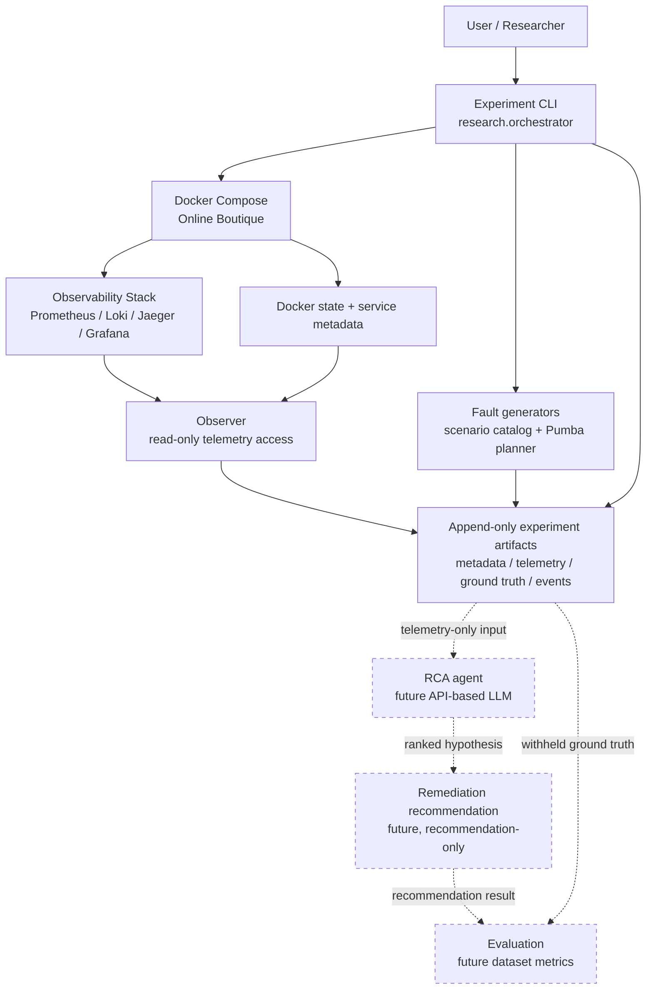
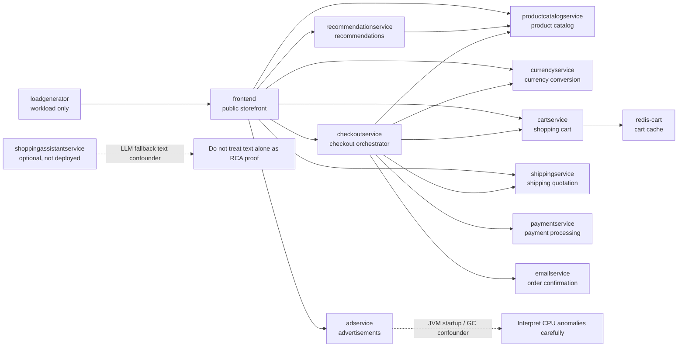
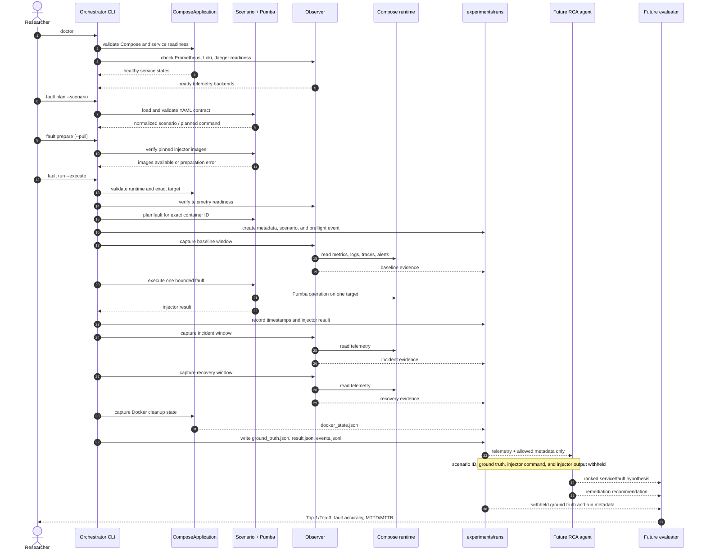
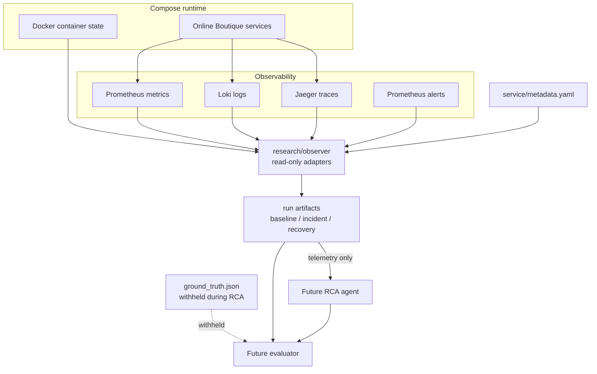
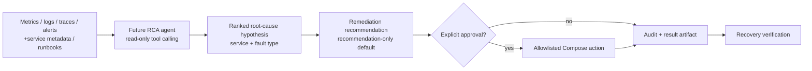
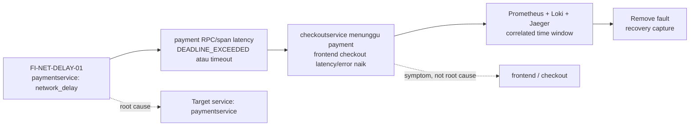

# Online Boutique Research Architecture

Dokumen ini menjelaskan arsitektur aktual thesis scaffold, fungsi folder di bawah
`research/`, serta chained process eksperimen dari startup sampai evaluasi. Runtime
penelitian menggunakan Docker Compose; direktori Kubernetes di root repo adalah upstream
reference material dan bukan deployment path penelitian.

Untuk eksplorasi visual, buka [Interactive Architecture Explorer](architecture-explorer.html).
Halaman tersebut berjalan offline dan menyediakan tab diagram, filter service, detail node,
highlight dependency, serta detail setiap tahap chained process.

Status diagram:

- garis solid menunjukkan komponen atau alur yang sudah tersedia di codebase;
- garis putus-putus menunjukkan komponen future, deferred, atau belum tervalidasi;
- `read-only` berarti tidak boleh melakukan mutasi terhadap runtime;
- `explicit gate + allowlist` berarti tindakan mutasi memerlukan persetujuan dan daftar aksi
  yang dibatasi.

## 1. Context architecture

Komponen utama yang sudah menjadi fondasi adalah Compose application adapter, read-only
observer, fault scenario catalog, orchestrator CLI, dan artifact helper. `agent/` dan
evaluation layer disiapkan oleh roadmap tetapi belum menjadi runtime lengkap.

## 2. Online Boutique service topology

`frontend` adalah gejala yang sering terlihat oleh pengguna, tetapi bukan otomatis root
cause. `loadgenerator` menghasilkan workload dan tidak boleh dipilih sebagai fault target.
Target fault harus berasal dari service yang `targetable` dan sedang deployed. `adservice`
memerlukan pemeriksaan noise JVM, sedangkan `shoppingassistantservice` saat ini optional,
tidak deployed, dan memiliki noise berupa respons LLM-generated.

## 3. Folder map di bawah `research/`

| Folder/file | Fungsi detail | Status saat ini |
|---|---|---|
| `research/agent/` | Boundary untuk orkestrasi LLM RCA, prompt sistem, dan wrappers observability. Prompt disimpan sebagai file dan tools harus read-only. | Struktur prompt/tools masih placeholder; implementasi agent ada di milestone berikutnya. |
| `research/compose/` | Docker Compose runtime penelitian, `.env.example`, healthcheck script, dan probe gRPC. Menjalankan prebuilt image Online Boutique serta observability services. | Aktif. Resource limit dan readiness menjadi constraint utama host 2-core. |
| `research/docs/` | Sumber metodologi dan keputusan: architecture, fault taxonomy, fault injection, experiment log, dan adaptasi reference architecture. | Aktif; dokumen ini menambahkan visualisasi arsitektur. |
| `research/experiments/` | Kontrak `ground-truth.schema.json` dan lokasi run artifact. `runs/` diperlakukan append-only dan di-gitignore. | Schema aktif; run data dibuat saat eksperimen tervalidasi. |
| `research/generators/` | Definisi fault yang tool-neutral, validasi scenario YAML, dan adapter Pumba allowlisted. | Aktif untuk CPU, memory, network delay, dan packet loss; disk/socket unavailable; code-level deferred. |
| `research/milestones/` | Roadmap fase 00–06, prerequisite, deliverable, dan definition of done. | Phase 00 selesai; phase 01 menjadi foundation; phase agent/evaluation belum lengkap. |
| `research/observability/` | Konfigurasi Prometheus, Loki, Promtail, OpenTelemetry/Jaeger, Grafana, dan container metadata exporter. | Aktif sebagai telemetry stack. |
| `research/observer/` | Adapter read-only untuk readiness check, Prometheus range query, Loki query, alert access, dan trace capture. | Aktif; tidak boleh mengubah container atau konfigurasi runtime. |
| `research/orchestrator/` | CLI dan lifecycle coordinator: `doctor`, `snapshot`, fault plan, image prepare, guarded fault run, capture, recovery, dan result. | Aktif untuk foundation dan controlled Pumba runs. |
| `research/service/` | Satu-satunya pemilik interaksi low-level Compose/Docker: service catalog, service state, readiness, resolved config, dan snapshot. | Aktif. |
| `research/utils/` | Centralized `ResearchConfig`, endpoint/path configuration, experiment ID, JSON writer, dan append-only event recorder. | Aktif. |
| `research/tests/` | Test untuk service catalog, Compose adapter, observer, fault catalog, artifact/schema, serta metadata exporter. | Aktif sebagai regression boundary. |
| `research/requirements.txt` | Dependency Python untuk framework penelitian. | Aktif. |
| `research/__init__.py` | Menjadikan `research` sebagai Python package untuk module execution. | Aktif. |

Folder `__pycache__/` adalah hasil eksekusi Python dan bukan bagian dari logical architecture.

## 4. Chained process eksperimen

### Safety and stop conditions

1. Scenario loader menolak category/type, parameter, target, status, atau schema yang invalid.
2. Scenario `experimental_unavailable` dan `deferred_faulty_image` tidak boleh dijalankan
   melalui Pumba.
3. Runtime, target container, image preflight, dan telemetry backend harus siap sebelum
   fault dimulai.
4. Baseline failure menghentikan proses sebelum injection dan mencatat `baseline_failed`.
5. File lock mencegah dua fault berjalan bersamaan pada host yang sama.
6. Command Pumba dibuat sebagai tokenized subprocess tanpa shell dan memiliki timeout.
7. Recovery dan cleanup state direkam setelah injection; error tetap menjadi artifact.

## 5. Telemetry, evidence, dan RCA boundary

Agent input boleh mencakup metrics, logs, traces, alerts, service topology, service
metadata, dan approved runbooks. Agent tidak boleh menerima scenario identifier, ground
truth, injection command, atau injector output karena informasi tersebut membocorkan label
evaluasi.

## 6. RCA dan remediation boundary

Remediation yang valid harus dibatasi pada aksi Compose yang aman, reversibel, dan dapat
diaudit. Kubernetes autoscaling, arbitrary shell execution, dan mutasi container tanpa
allowlist berada di luar boundary penelitian.

## 7. Fault propagation examples

Pola yang sama digunakan untuk resource fault dan code-level fault, tetapi bukti yang dicari
berbeda. CPU/memory menekankan resource pressure dan latency; network menekankan RPC error,
retry, dan deadline; code-level menekankan semantic error, stack trace, atau failed parent
span saat transport dapat tetap terlihat sehat.

## 8. Diagram yang direkomendasikan

| Prioritas | Diagram | Nilai penjelasan | Audiens |
|---|---|---|---|
| 1 | Context architecture | Memberi gambaran satu halaman tentang seluruh sistem thesis. | Pembaca thesis dan reviewer |
| 2 | Service dependency topology | Menjelaskan fan-out, dependency, dan kemungkinan propagation path. | Developer/SRE |
| 3 | Experiment chained process | Menjelaskan urutan eksperimen, safety gate, artifact, dan recovery. | Peneliti/SRE |
| 4 | Telemetry/evidence flow | Menjelaskan asal data dan boundary data yang boleh masuk agent. | Peneliti AI dan evaluator |
| 5 | RCA/remediation boundary | Menjelaskan perbedaan rekomendasi dan eksekusi mutasi. | Reviewer keamanan |
| 6 | Fault propagation | Menjelaskan mengapa symptom di frontend tidak cukup untuk menentukan root cause. | Evaluator RCA |
| 7 | Artifact/data lineage | Cocok ditambahkan jika dataset eksperimen mulai besar dan perlu audit lineage. | Evaluator thesis |

Untuk presentasi singkat gunakan diagram 1, 2, dan 3. Untuk bab implementasi gunakan semua
diagram 1–6. Diagram 7 menjadi tambahan ketika phase ground-truth dan evaluation sudah
menghasilkan banyak run.

## Related sources

- [`ARCHITECTURE.md`](ARCHITECTURE.md) — keputusan Compose, observability, hardware, dan LLM.
- [`FAULT_TAXONOMY.md`](FAULT_TAXONOMY.md) — normalized fault types dan research boundaries.
- [`FAULT_INJECTION.md`](FAULT_INJECTION.md) — scenario contract, lifecycle, dan methodology.
- [`REFERENCE_ARCHITECTURE_ADAPTATION.md`](REFERENCE_ARCHITECTURE_ADAPTATION.md) — alasan adaptasi dari reference architecture.
- [`../service/metadata.yaml`](../service/metadata.yaml) — service roles, dependencies, dan targetability.
- [`../experiments/ground-truth.schema.json`](../experiments/ground-truth.schema.json) — canonical ground-truth contract.
